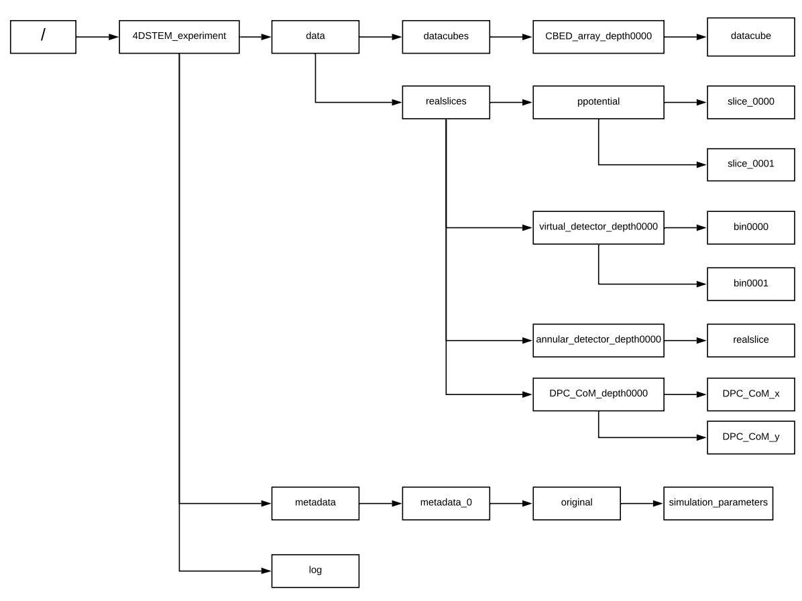

Outputs are written to [HDF5 files](https://www.hdfgroup.org/solutions/hdf5/) with a format compatible with the analysis package [py4DSTEM](https://www.github.com/py4DSTEM/py4DSTEM). All output from `Prismatic` is packed into a single file. There are potentially 2D, 3D, and 4D outputs, as well as calculations of DPC center of mass and the calculated projected potential slices. For all outputs, there are at least two dimensions corresponding to X and Y probe positions. At each position, `Prismatic` can output the full probe (4D), a radially integrated output placed into virtual detector bins (3D), an image further integrated over a range of detector bins to produce a single value for each scan position (2D), the differential phase contrast center of mass, and the projected potential. The 3D output is considered to be the primary result and is the only output produced by default; however, any combination of 2D, 3D, 4D, DPC, and potential slice outputs may be produced with a single simulation. The metadata parameter `filename_output` is set with "-o" at the command line.

* 2D output: Produced by adding the command line option "-2D ang\_min ang\_max" where "ang\_min" and "ang\_max" are the inner and outer integration angles in mrad. By default this is off. The 2D output is saved into a single array in the HDF5 file under `/4DSTEM_experiment/data/realslices/annular_detector_depth####/realslice`, where `####` is the output layer (always `0000` if using the `PRISM` algorithm).
* 3D output: Controlled by command line option "-3D 0/1" where 0 or 1 is a boolean on/off. The 3D output is saved to `filename_output`. By default this is on.  The 3D output is saved into a series of realslice arrays in the HDF5 file under `/4DSTEM_experiment/data/realslices/virtual_detector_depth####/bin$$$$`where `####` is the output layer (always `0000` if using the `PRISM` algorithm) and `$$$$` is the virtual detector bin.
* 4D output: Controlled by command line option "-4D 0/1" where 0 or 1 is a boolean on/off. By default this is off. The 4D output is saved into a single, chunked array in the HDF5 file under `/4DSTEM_experiment/data/datacubes/CBED_array_depth####/datacube`, where `####` is the output layer (always `0000` if using the `PRISM` algorithm).
* DPC Center of Mass: Controlled by command line option "-DPC 0/1" where 0 or 1 is a boolean on/off. By default this is off. The DPC output is saved into two realslice arrays in the HDF5 file under `/4DSTEM_experiment/data/realslices/DPC_CoM_depth####/DPC_CoM_$`, where `####` is the output layer (always `0000` if using the `PRISM` algorithm) and `$` is either `x` or `y`.
* Potential Slices: Controlled by command line option "-ps 0/1" where 0 or 1 is a boolean on/off. By default this is off. The potential slice output is saved into a series of realslice arrays  in the HDF5 file under `/4DSTEM_experiment/data/realslices/ppotential/slice_####`where `####` is the potential slice (increasing in Z).

For example, the `prismatic` command 
`./prismatic -i atoms.XYZ -2D 0 10 -4D 1 -3D 1 -o example.h5`
will produce "prism\_2Doutput\_example.h5" with the 2D bright field image integrated from 0-10 mrad, the 3D output, and the 4D output, but will not include the DPC calculation nor potential slices. Physically relevant metadata from the simulation is saved into the `metadata` group under `/4DSTEM_experiment/metadata/metadata_0/original/simulation_parameters` as a series of attributes that can be accessed as key-value pairs. A parameter file is also generated at the end of the simulation and placed into the home directory of the user. 

||
|:---:|
| File structure of `Prismatic` HDF5 output. |

