# Prismatic Tutorial (Under Construction)   
---
*This tutorial is a work in progress and will be finished in the very near future*

## Table of Contents  
- [Examples](#examples)
- [Prismatic GUI simulation of decahedral NP](#tutorialdeca)
- [PyPrismatic: Using Prismatic through Python](#pyprismatic)  


## Examples

Within the source code of `Prismatic` is an "examples" folder that contains some example scripts of how one might run simulations using *Prismatic*. There is a mixture of Python examples use `PyPrismatic` and bash shell scripts using `prismatic`. Both tools are accessing the exact same underlying code -- they just provide different entry points. Use whatever you feel most comfortable with.


<a name="tutorialdeca"></a>
## Prismatic GUI simulation of decahedral NP

[Issues with this tutorial?  Email Colin at "clophus" at "lbl.gov"]

In this example we will walk you through the entire procedure for generating a STEM simulation of a decahedral nanoparticle. This simulation should match the result shown in the PRISM algorithm paper: [DOI:10.1186/s40679-017-0046-1](http://dx.doi.org/10.1186/s40679-017-0046-1), specifically Figures 3, 4 and 5. Below is an overview of the sample we will construct, and an example of image simulations generated from both the multislice method, and the PRISM algorithm with varying degrees of accuracy.


| 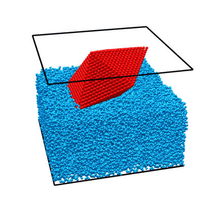 | 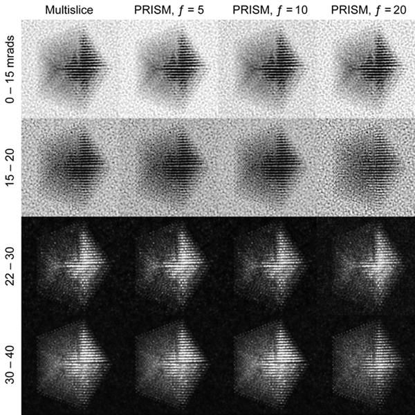 | 
|:---:|:---:|
| Atomic model of a decahedral nanoparticle resting upon an amorphous carbon substrate. | STEM annular bright field and annular dark field image simulations taken from Figure 4 of the [PRISM algorithm paper](http://dx.doi.org/10.1186/s40679-017-0046-1). |


The steps we will follow for this tutorial are:

1. Download atomic coordinate files.
2. Construct unified atomic model in `Matlab`.
3. Export coordinates in .xyz format for `Prismatic`.
4. Import atoms into Prismatic and set parameters.
5. Test PRISM vs Multislice accuracy.
6. Run PRISM simulation, save output as .mrc.
7. Generate final image outputs.

### 1 - Download atomic coordinate files.

To simulate a realistic nanoparticle sample, we require two sets of atomic coordinates. The first is (obviously) the nanoparticle itself. We have chosen to simulate a defected nanoparticle, as this is a more realistic sample with more interesting features than the ideal nanoparticles often used in atomic model simulations. Such a structure is available for download from a page on the [Miao group website](http://www.physics.ucla.edu/research/imaging/dislocations/index.html). I've saved the coordinates as a .csv file [here](data/atoms_deca_cartesian_x_y_z_ID.csv). Each row corresponds to an atom, and the four columns are [x y z ID] where (x,y,z) are the 3D position in Angstroms, and ID is the atomic Z number of the atoms. In this case I've used 78 for platinum, but this can be changed to any atomic species for this example simulation.

This nanoparticle has a defected decahedral geometry; a type of multiply-twinned particle composed of 5 tetrahedral crystalline FCC segments (see [Wikipedia/Pentagonal_bipyramid](https://en.wikipedia.org/wiki/Pentagonal_bipyramid) for an stretched image of the shape). The 5 boundaries between these 5 segments are FCC crystalline twins. In this decahedral particle, 2 of the 5 segments contain defects - stacking faults and dislocations.  This makes the particle interesting from a imaging standpoint, since the symmetry breaking of the defects leads to complex diffraction signals even when viewing down crystallographic axes.

The second set of coordinates is often overlooked in image simulations - we need a block of atoms representing a realistic substrate.  A substrate is an unavoidable part of electron microscopy experiments, since samples stubbornly refuse to float in free space in the path of the electron beam. In order to affect the experiment as little as possible, we typically utilize very thin, low atomic number substrates, usually ultra-thin amorphous carbon supports. We could just randomly generate coordinates and then delete the atoms that are too close together, but the literature contains better examples. Let's use the amorphous carbon blocks given in [this paper](http://dx.doi.org/10.1063/1.4831669) by Ricolleau et al. These authors have (generously) made some of their realistic amorphous carbon structures available for download. In case you don't have access I have again saved the coordinates as a .csv file [here](data/atoms_amorCarbon_50nmCube_x_y_z_ID.csv),

We now have all of the atomic coordinates required to build our simulation "scene."


### 2 - Construct unified atomic model in `Matlab`.

This section can be completed using any interactive programming language. I will describe the procedure using `Matlab` code as an example, which can be easily adapted to the language of your choice. First, import the data into `Matlab` (right click on the .csv files and select "Import Data," naming the two arrays something suitable).  Next, we perform a few simple steps:

* Tile 5x5x5nm amorphous carbon cube 4 times to form a 10x10x5 nm substrate.
* Tilt nanoparticle to desired orientation.
* Position nanoparticle in center of cell, just above / slightly inside the substrate.
* Delete substrate atoms too close to / overlapping nanoparticle atoms.

First, let's tile the subtrace block 2x2 times to make it large enough to hold the nanoparticle, without periodic wrap-around artifacts.  We will also permute the dimensions of 3 out of 4 blocks to prevent tiling artifacts.  The boundaries will not be perfectly physical, but this error will be small.  Assuming we import the xyz coordinates of the substrate block as "xyzSub" we can use the below code to tilt the subtrate (and cell boundaries) by 2x2x1:

```matlab
cellSub = [50 50 50];       % Original substrate cell size
cellDim = [2*cellSub(1:2) cellSub(3)];
atomsSub = [ ...
    xyzSub(:,[1 2 3])+repmat([0          0          0],[size(xyzSub,1) 1]);
    xyzSub(:,[2 1 3])+repmat([cellSub(1) 0          0],[size(xyzSub,1) 1]);
    xyzSub(:,[3 1 2])+repmat([0          cellSub(2) 0],[size(xyzSub,1) 1]);
    xyzSub(:,[2 1 3])+repmat([cellSub(1:2)          0],[size(xyzSub,1) 1])];
```

Next, I've chosen to rotate the nanoparticle by 30 degrees around the x-axis, placing the 2 defected sectors onto a "low index" zone axis (atomic columns far apart) and the other 3 sectors onto a "high index" zone axis (atomic columns closer together).  I typically use "z-x-z" rotation for my three [Euler angles](https://en.wikipedia.org/wiki/Euler_angles), for example in the code below: (note I also translate the particle to sit "on top" of the now 10x10x5 nm substrate block)

```matlab
theta = [0 -30 0]*pi/180; % 3 angles for ZXZ rotation of NP
shiftNP = [50 50 60.2];   % NP (x,y,z) position
xyzNP = xyzNP(:,1:3);     % Remove columns >3 in the NP array
for a0 = 1:3  % Center on (0,0,0)
    xyzNP(:,a0) = xyzNP(:,a0) - mean(xyzNP(:,a0));  
end
% Rotate and translate NP
m = [cos(theta(1)) -sin(theta(1)) 0;
    sin(theta(1)) cos(theta(1)) 0;
    0 0 1];
xyzNP = xyzNP * m;
m = [1 0 0;
    0 cos(theta(2)) -sin(theta(2));
    0 sin(theta(2)) cos(theta(2))];
xyzNP = xyzNP * m;
m = [cos(theta(3)) -sin(theta(3)) 0;
    sin(theta(3)) cos(theta(3)) 0;
    0 0 1];
xyzNP = xyzNP * m;
for a0 = 1:3
    xyzNP(:,a0) = xyzNP(:,a0) + shiftNP(a0);
end
```

Now we need to delete any overlapping atoms between the substrate and NP.  This is easily done by testing each substrate atom to see if it is too close to the atom inside the nanoparticle that it is closest too. Below I've used a cutoff separation of 3 Angstroms.

```matlab
rMin = 3;                   % minimum atomic separation
r2 = rMin^2;
del = false(size(atomsSub,1),1);
for a0 = 1:size(atomsSub,1)
    if (  min((atomsSub(a0,1)-xyzNP(:,1)).^2 ...
            + (atomsSub(a0,2)-xyzNP(:,2)).^2 ...
            + (atomsSub(a0,3)-xyzNP(:,3)).^2) < r2)
        del(a0) = true;
    end
end
atomsSub(del,:) = [];
```

You can find the above code (with some included plotting code) at [this link](data/build_scene_deca_tilted_on_amorphous_carbon.m).  The visualizations generated by this `Matlab` script are included below for reference. This code also adds a 4th atomic column, where you can specify the species of both the nanoparticle and substrate - which I have set to platinum and carbon respectively.  Note that in Prismatic, the beam direction is always along the third (z) direction of the cell.  We also do not (currently) allow non-orthogonal cell boundaries, which may require you to tile your unit cell to form an orthorhombic or pseudo-orthorhombic cell before running the simulation.


| 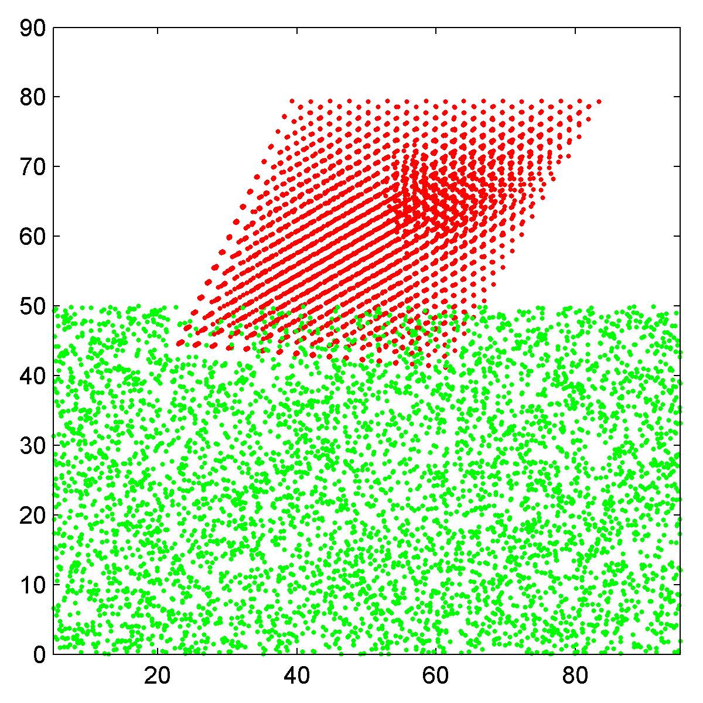 | 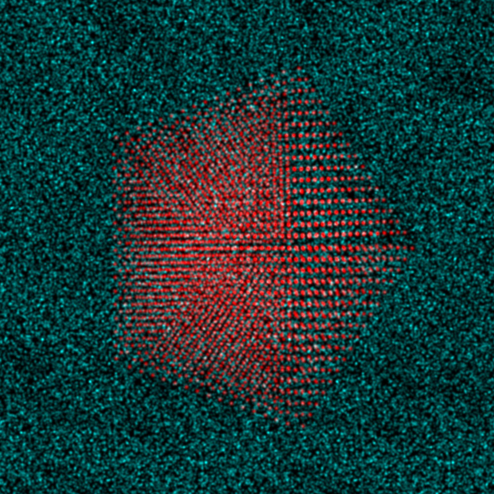 | 
|:---:|:---:|
| Side view scatter plot of the atomic coordinates, Pt nanoparticle in red and carbon substrate in green. | Top down view of nanoparticle plus substrate, rendered as an RGB image. |


### 3 - Export coordinates in .xyz format for `Prismatic`.

`Prismatic` uses the same .xyz input format as `computem`.  As in most .xyz files, the first two rows are reserved for comments and each following row contains "space-separated" values. The first row can be set to anything, typically it is used for a descriptive title of the simulation cell. We will use the second row to list the three values specified above as "cellDim" which represent the size of the simulation cell in Angstroms.  All following rows consist of columns containing six values:

1. atomic number
2. x 
3. y 
4. z 
5. occupancy 
6. RMS thermal vibration

where the coordinates (x,y,z) are cartesian values in Angstroms, the occupancy is a number from 0 to 1 representing how frequently that site contains an atom, and the final value is the root-mean-square (RMS) thermal vibration coefficient, also in Angstroms.  The vibration of most atoms at room temperature follows a Gaussian distribution with a standard deviation of 0.05-0.1 Angstroms.  So, for the simulation file described above, the first several lines will look like:

```csv
Atomic coordinates for decahedral nanoparticle on amorphous carbon
   100.00000  100.00000  80.000000
6  30.728000  40.226000  3.720700  1  0.080000
6  28.026000  39.412000  6.253700  1  0.080000
6  21.581000  47.227000  3.620000  1  0.080000
6  22.244000  44.872000  3.643700  1  0.080000
...
```
 
Lastly, to maintain compatibility with `computem` we typically write "-1" in the last or second last line of the .xyz file. A simple `Matlab` script that writes .xyz files in the above format  is given here:

```matlab
function [] = writeXYZ(fileName,comment,cellDim,IDarray,xyzArray,occArray,uArray)
% Write .xyz file for Prismatic

if length(IDarray) == 1
    IDarray = IDarray*ones(size(xyzArray,1),1);
end
if length(occArray) == 1
    occArray = occArray*ones(size(xyzArray,1),1);
end
if length(uArray) == 1
    uArray = uArray*ones(size(xyzArray,1),1);
end

% Initialize file
fid = fopen(fileName,'w');
% Write comment line (1st)
fprintf(fid,[comment '\n']);
% Write cell dimensions
fprintf(fid,'    %f %f %f\n',cellDim(1:3));
% Write atomic data
dataAll = [IDarray xyzArray occArray uArray];
for a0 = 1:size(dataAll,1)
    fprintf(fid,'%d  %f  %f  %f  %d  %f\n',dataAll(a0,:));
end

% Write end of file, for computem compatibility
fprintf(fid,'-1\n');
% Close file
fclose(fid);

end
```
This script can be downloaded [here](data/writeXYZ.m), and the final .xyz output for the above cell containing a rotated decahedral NP on an amorphous carbon substrate can be downloaded at [here](data/AuDeca_amorCarbon.xyz). This `Matlab` script requires string inputs for "fileName" and "comment," the three value vector cellDim, the array of atomic IDs and xyz coordinates (in Angstroms), and finally arrays of all occupancy and RMS displacement values in occArray amd uArray respectively. Converting fractional atomic coordinates to cartesian coordinates in Angstroms can be done inline:

```matlab
writeXYZ('AuDeca_amorCarbon.xyz',...
'Atomic coordinates for decahedral nanoparticle on amorphous carbon',...
cellDim,atoms(:,4),atoms(:,1:3).*repmat(cellDim,[size(atoms,1) 1]),1,0.08);
```


### 4 - Import atoms into Prismatic and set parameters.

It's time to run *Prismatic*!  You can find the GUI installers [here](installers.md). For this tutorial, I will show screenshots from the OSX build, but the Windows version should be essentially identical. Once you have installed *Prismatic*, run the program *prismatic-gui.app* or *prismatic-gui.exe*. You should see the startup GUI:

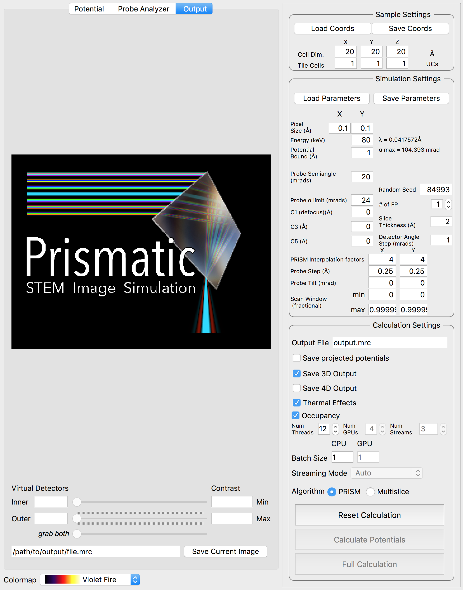{:width="828px"}

The first step is to click **Load Coords**, and then browse to the file we created previously, `AuDeca_amorCarbon.xyz`. Once you load the file, the cell dimensions should immediately update to the correct values:

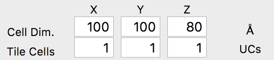{:width="271px"}

Now we will set the simulation parameters.  For this simulation we will use the default values for the pixel size (0.1 Angstroms), the electron energy (80 keV) and the potential boundary (1 Angstrom). The pixel size specified here is **NOT** the probe spacing value, i.e. the pixel size of a microscope STEM image. Instead, this value is the pixel size used to sample the atomic potentials and compute the propagating electron waves. A smaller pixel size will allow higher scattering values - try changing this value to see the updated maximum scattering angle, \alpha_max.

We will also use the default probe semiangle of 20 millirads, and probe alpha limit of 24 millirads. This first value defines the size of the probe forming aperture (or pupil function) of our simulation.  The second limit is for `PRISM` calculations - because the probe forming aperture has a soft edge, some pixels outside of 20 millirads must be included in the calculation.  The next several settings refer to the defocus, spherical aberration coefficients C3 and C5, number of frozen phonon configurations, slice thickness and output detector angle separation. We can leave all of these settings at the default values. At this point, we can verify our simulation cell has loaded correctly by performing a potential-only calculation by clicking the **Calculate Potentials** button. After a brief calculation, we can tweak the plotting outputs to clearly show the simulation cell: (square root intensity of all slices)

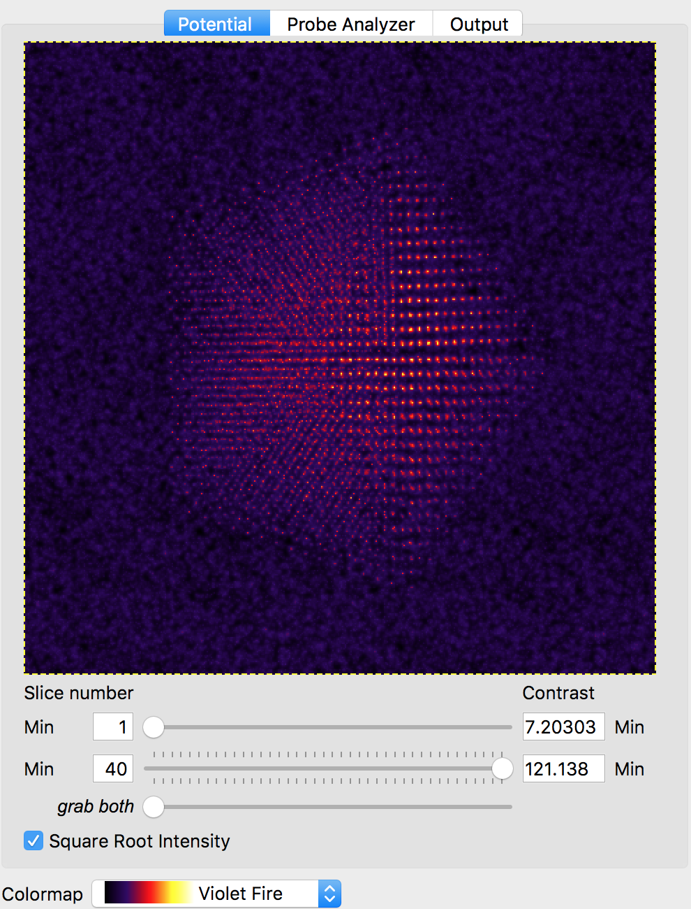{:width="495px"}

The final set of simulation parameters will strongly affect the required simulation time. The first two values refer to the `PRISM` interpolation factors.  The output probe will only be calculated inside the cropping window, with a size given by the simulation cell size divided by the interpolation factor(s). These factors can (and should) be different in the x and y directions if the simulation cell is not square. For example, for a simulation cell size of 400 x 100 Angstroms, if we used interpolation factors of 20 and 20, the output cropped cell would be 20 x 5 Angstroms. The smaller dimension of 5 Angstroms is almost certainly too small to hold a STEM probe. It would be much better to use interpolation factors of 20 and 5, for a cropped region of 20 x 20 Angstroms.

For our simulation, we are going to start with interpolation factors of 20 and 20, giving a cropped output probe size of 100 / 20 = 5 Angstroms. In the next section, we will test this interpolation factor for accuracy by comparing it with multislice simulations.  We can leave the other settings at the default values, i.e. the probe tilt, probe step size and scan window. The scan window values are fractional, ranging from 0 to 1.  Values of 0 and 0.99999 will span the simulation cell without duplicating the edge pixels (0 and 1). Your settings should now be:

{:width="250px"}


### 5 - Test PRISM vs Multislice accuracy.

The `PRISM` algorithm is very fast - for a given interpolation factor *f*, it can provide a speedup of *f^2* to *f^4* relative to the multislice calculation time, depending on the simulation cell dimensions and the calculation parameters. However, it must sacrifice some accuracy to do so, with the error increasing as the interpolation factor *f* is increased. Ideally we want the error relative to multislice to be <1%, or even <0.1%, but this may not always be possible due to limited calculation times. Thus when choosing a value for *f*, we must balance accuracy against the time we are willing to alot for a given calculation.

Now, we will compare the `PRISM` algorithm with the `multislice` algorithm, using a tool built into *Prismatic*.  Click on the *Probe Analyzer* button at the top of the image panel.  Immediately you should see an array of probe images below the atomic potential. Ignore the uninitialized images for now. Generally, we want to test the accuracy of `PRISM` vs `multislice` using a region of the sample where the probe will broaden the most. Therefore change the both X and Y settings next to the **calculate** button on the image panel to 50 Angstroms. Then, click the **calculate** button.  Note that even without a GPU, this calculation should be relatively fast (the settings on the bottom right panel control the number of CPU and GPU threads). You should now see:

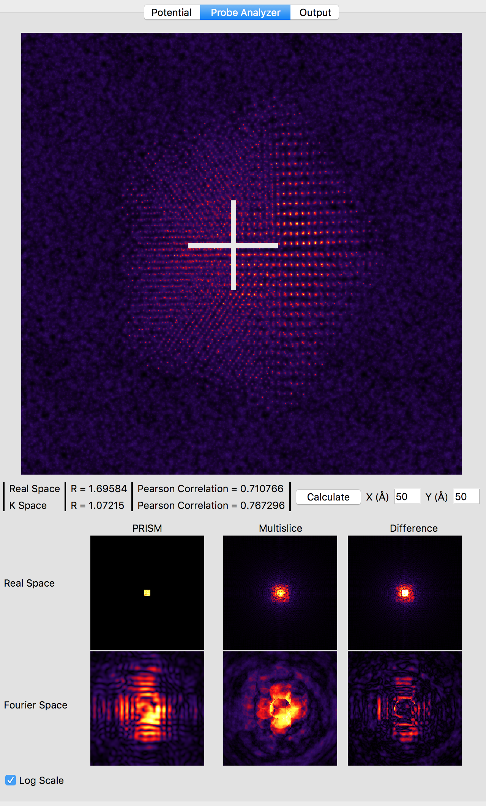{:width="640px"}

Note that the probe location is shown as a large white cross at the center of the image (50, 50 Angstroms). The bottom 6 panels compare `PRISM` simulations to `multislice` simulations. Huge artifacts are immediately visible in the `PRISM` Fourier space probe image - this is due the probe being far larger than the cropping region of 5 x 5 Angstroms for an interpolation factor of 20. Looking at the multislice probe image in realspace (top center panel) we see the probe is at least twice as large as this cropping region. Therefore we can next try halving the interpolation factor. Set both the x and y direction intepolation factors to 10, and then click the **calculate** button on the image panel.  This calculation will take approximately 4 times longer, since the `PRISM` compact S-matrix now contains 4 times as many plane waves. Once the calculation is complete, you should see:

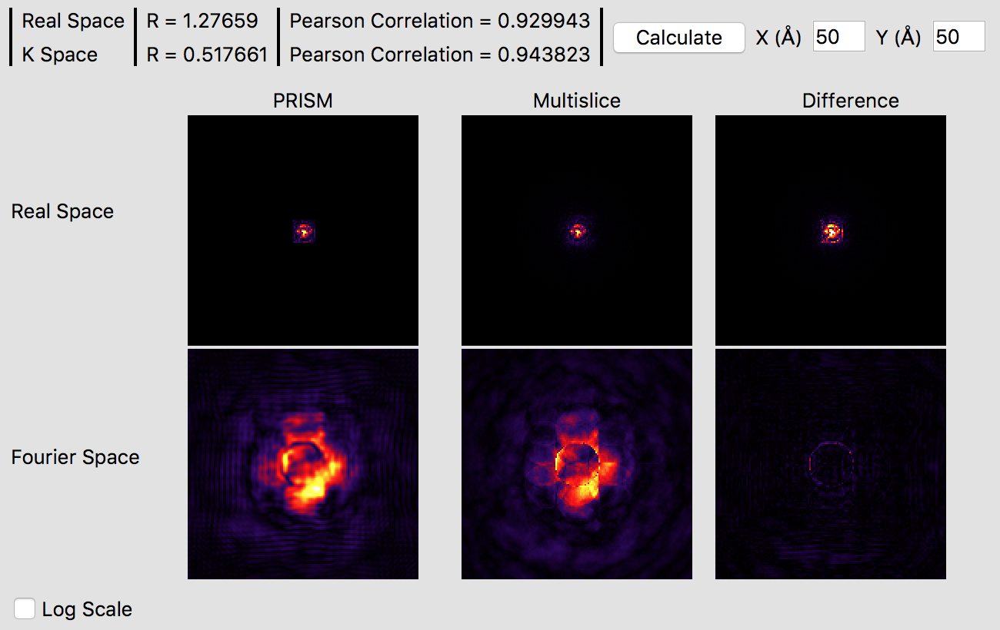{:width="650px"}

It is immediately obvious that the `PRISM` probe is significantly more accurate with an interpolation factor of 10 as opposed to 20.  Small ringing artifacts are present in the Fourier space probe image due to the cropping window clipping the tails of the probe in realspace, but these artifacts are fairly minor.  The various intensity features are very similar in both methods, which you can see in more detail by clicking the **Log Scale** box to scale the intensities.  The edge of the probe's aperture function shows some differences, but these are primarily due to the different sampling scales. Overall, this interpolation factor of 10 would be sufficiently accurate for an exploratory simulation, but probably not for a publication. Thus, we will halve the interpolation again to improve the accuracy further. Set both the x and y direction intepolation factors to 5, and then click the **calculate** button on the image panel. This calculation will require a few minutes on a fast modern computer, perhaps ten on an older laptop.  If you have a GPU (or more than one) it will be very fast. Once this calculation is complete, you will see:

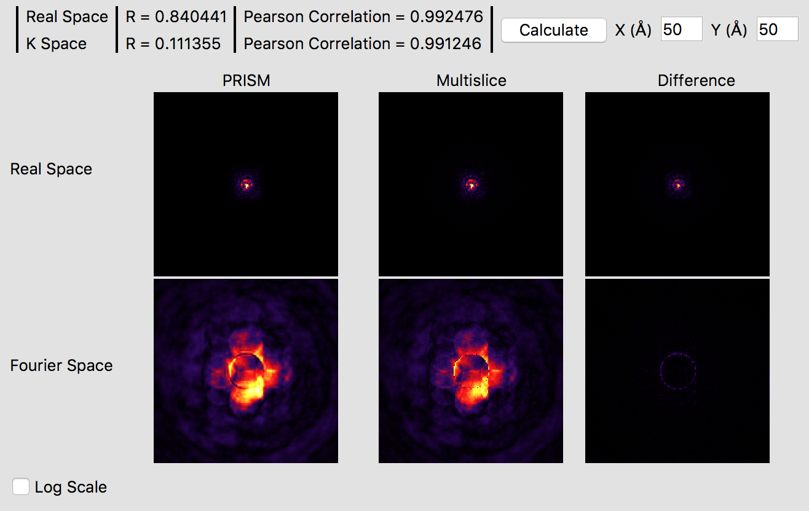{:width="658px"}

These settings should produce a high accuracy `PRISM` simulation. The correlation function plotted gives a good idea of the accuracy of the simulation, which is over 99%. Checking the **Log Scale** box shows that `PRISM` has captured all of the fine details of the STEM probe in Fourier space. 


### 6 - Run PRISM simulation, save 3D output as .mrc.

We are now almost ready to run the full `PRISM` simulation in *Prismatic*. First, make sure the desited number of CPU threads and GPUs / GPU streams are selected. Using all of your computer's power will speed up the simulation, but could make watching videos on Youtube while the simulation runs difficult. Additionally, the CPU threads will run far more slowly than any GPU streams (if available).  Therefore a GPU-only simulation is a common configuration. 

The other consideration is which outputs to save. By far the most common use-case is to output the 3D scattering signal, created by integrating radially in Fourier space. This allows us to create virtual detector images with any annular ranges. For example, in this simulation with a 20 millirad STEM probe, we could sum the output detectors from 1 to 20 millirads to form a bright field image. The output file name must also be specified - **make certain you have specified a valid output path**.  For example, on my OSX machine I am using the following output path and file name:

/Users/cophus/STEMsims/DecaSimulation.mrc 

We will also leave the thermal effects box checked, even though we are performing a single frozen phonon simulation. For a more accurate output, we can in the future run 8 or even 16 frozen phonon configurations. The final few settings control whether the simulation is a `PRISM` or `multislice` simulation, and whether to use streaming mode or not. The streaming mode will use less GPU RAM, but will take longer to compute. For this simulation, I am using 12 CPU threads and 0 GPUs, since my OSX workstation does not not have a CUDA capable GPU. Once all settings are correct, click the **Full Calculation** button.  Even without a GPU, this simulation will complete in under an hour on my machine.


### 7 - Generate final image outputs.

After the simulation is completed, you have two ways to analyze the results. The first is directly inside of the Prismatic program. Clicking on the **Output** tab at the top of the imaging panel will bring up the 3D interactive output. You can now move the inner and outer detector angles using the sliders below. Once you have formed the desired image, the **Save Current Image** button can be used to export it. For example, below I have created a virtual bright field (BF) image by using an annular range of 0 - 20 millirads:

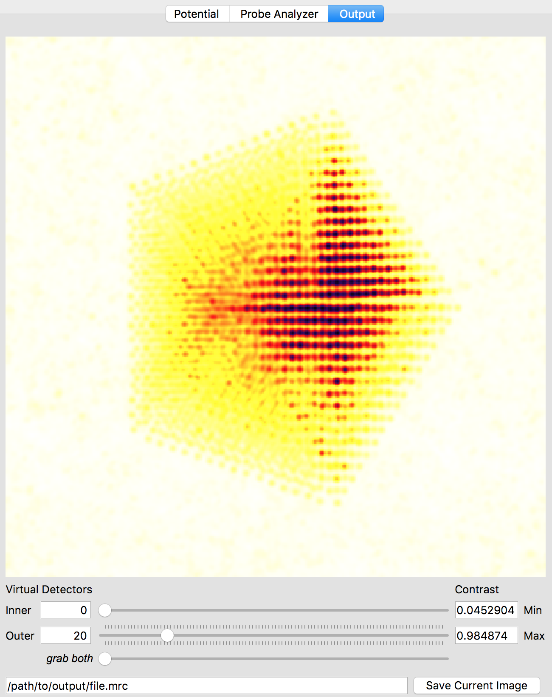{:width="375"}

Better atomic contrast (especially for weakly scattering atoms) can be obtained with an annular bright field (ABF). Other types of images we might record such as annular dark field (ADF) or high angle annular dark field (HAADF) images are also shown below. The ability to set the detector position after the simulation has completed is why we typically export the STEM imaging signal as a function of scattering angle, with finely spaced angular steps.

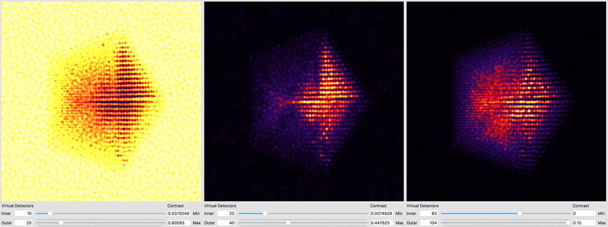{:width="600"}

The other way is to use external software to plots images taken from the saved .mrc file.  For example, in Matlab we might run something like:

```matlab
mrc = mrcReader('/Users/cophus/STEMsims/DecaSimulation.mrc');
stack = permute(mrc.stack,[2 3 1]);

figure(1)
clf

% bright field image
axes('position',[0.0 0.5 0.5 0.5]); 
imagesc([sum(stack(:,:,1:20),3)]); 
axis equal off

% annular bright field image
axes('position',[0.5 0.5 0.5 0.5]); 
imagesc([sum(stack(:,:,11:20),3)]); 
axis equal off

% annular dark field image
axes('position',[0.0 0.0 0.5 0.5]); 
imagesc([sum(stack(:,:,21:40),3)]); 
axis equal off

% high angle annular dark field image
axes('position',[0.5 0.0 0.5 0.5]); 
imagesc([sum(stack(:,:,61:end),3)]); 
axis equal off

colormap(gray(256))

```

Note that the .mrc data is written out in c array ordering, and so I permute the data to move the angular range to the third dimension, and the probe coordinates from dimensions (2,3) to (1,2). I also plot the 4 images into 4 different axes, because each requires a different colour range. This script produces the follow figure:

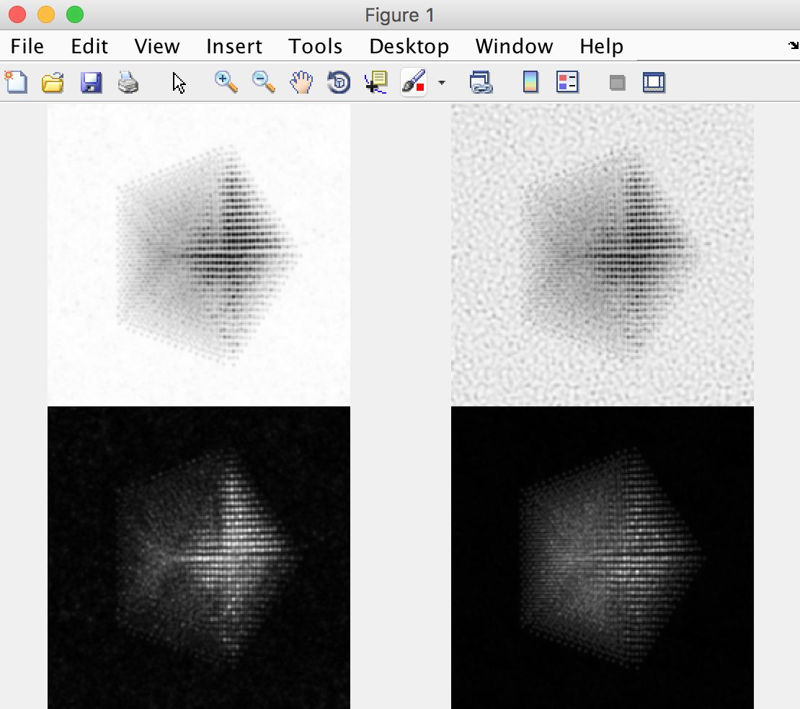{:width="555"}


<a name="pyprismatic"></a>
## PyPrismatic: Using Prismatic through Python  

*Instructions for installing `PyPrismatic` may be found at [here](installation.md)*

To run a simulation with `PyPrismatic`, you simple create a `Metadata` object, adjust the parameters, and then execute the calculation with the `go` method. A list of adjustable parameters is [in the About section](http://www.prism-em.com/about). These parameters can either be set with keyword arguments when constructing the `Metadata` object, or directly with the `.` operator. A simple example script utilizing both methods of setting parameters follows where the hypothetical input atomic coordinate information exists in the file "myInput.XYZ", the electron energy is set to 100 keV, and a 3x3x3 unit cell tiling is desired. The remaining parameters will be set to the default values (the `toString()` method can be used to print out all of the current settings).

~~~ python
import pyprismatic as pr
meta = pr.Metadata(filenameAtoms="myInput.XYZ", E0=100e3)
meta.tileX = meta.tileY = meta.tileZ = 3
meta.go()
~~~


